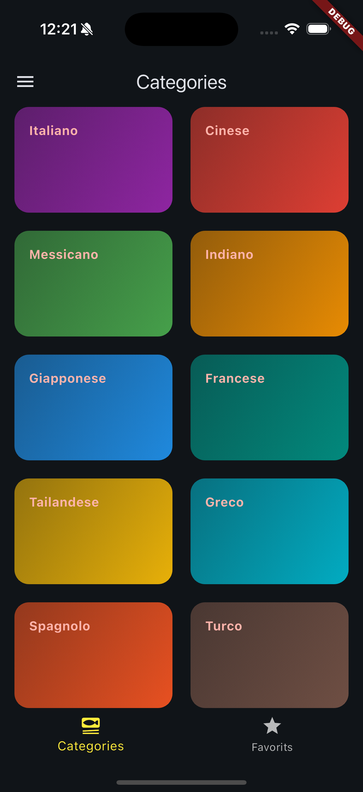
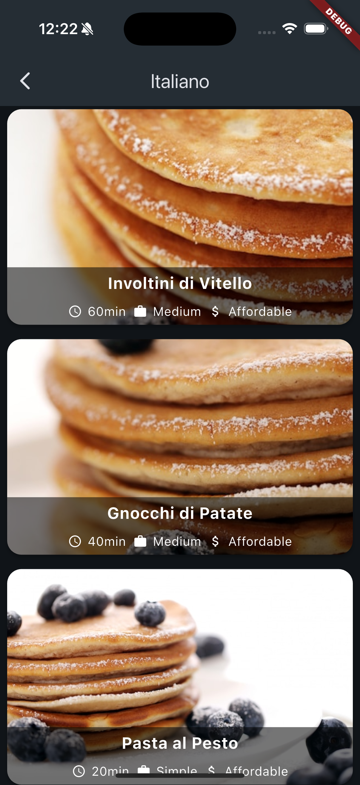
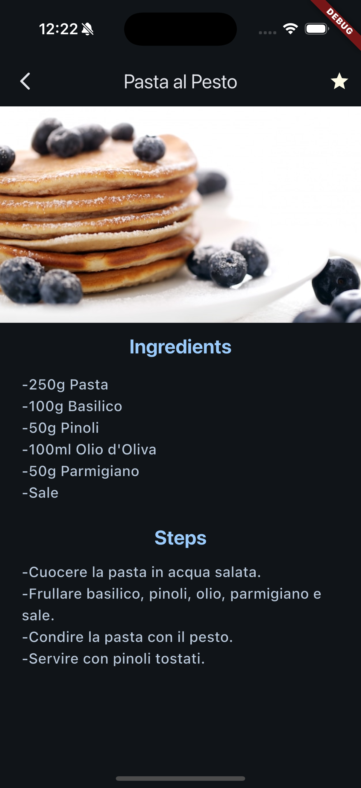
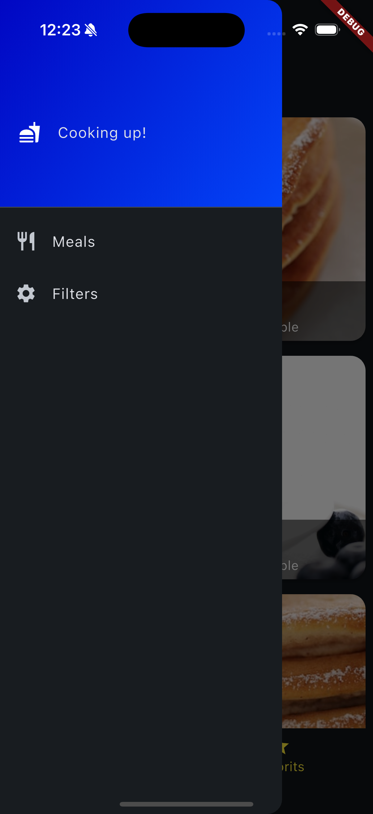
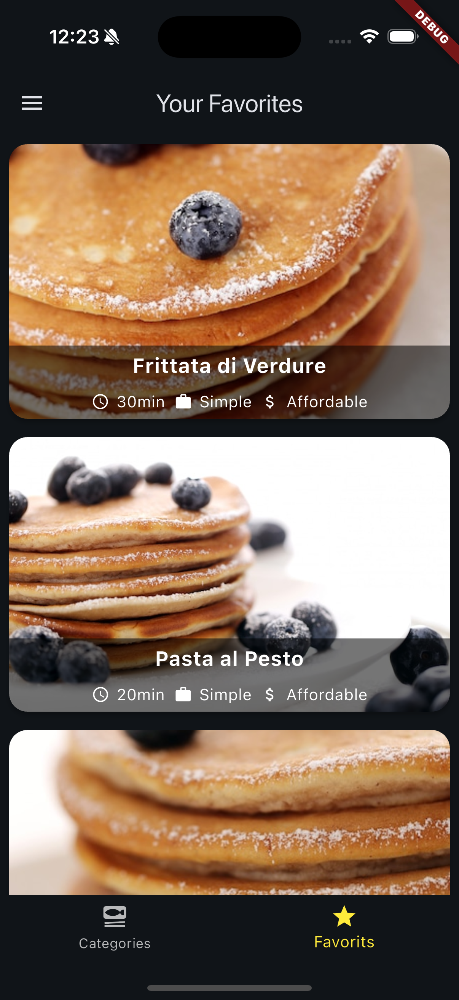
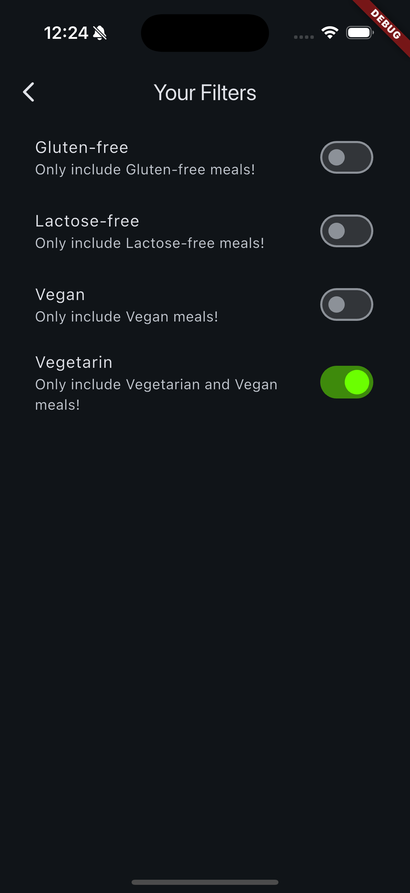

# Meals Flutter App

## Home Screen



## Category Screen



## Details Meal Screen



## Drawer Screen



## Favorites Screen



## Filter Screen



## Features

- Explore meal categories
- Apply dietary filters (Gluten-free, Lactose-free, Vegan, Vegetarian)
- Mark meals as favorites
- Intuitive user interface with smooth navigation

## Getting Started

This project is a starting point for a Flutter application. Follow these steps to set it up on your local machine:

### Prerequisites

- Flutter SDK installed on your machine.
- A suitable IDE (e.g., Android Studio, Visual Studio Code).
- An emulator or physical device for testing.

### Installation

1. Clone this repository:
   ```bash
   git clone https://github.com/Adriatik-Berdufi/meals
   cd meals
   flutter pub get
   flutter run
   ```

### Spiegazione delle sezioni:

1. **Titolo**: Meals Flutter App.
2. **Screenshot**: Mostra alcune immagini dell'app per dare un'idea visiva di come appare.
3. **Features**: Elenca le caratteristiche principali dell'app.
4. **Getting Started**: Fornisce istruzioni su come installare e avviare il progetto.
